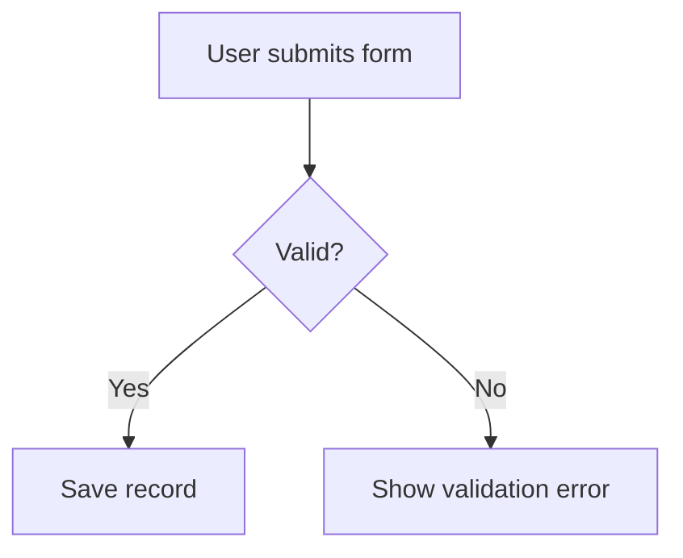
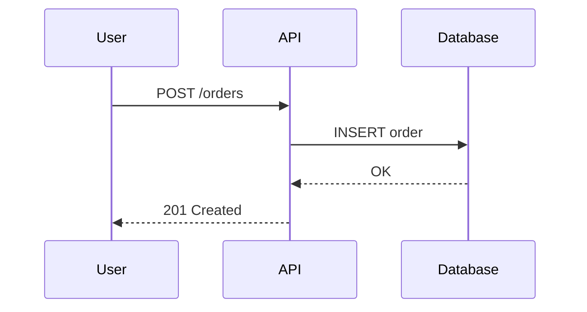

# Skill: Mermaid Diagramming Cheatsheet

Load this skill whenever a diagram is needed.

## Choosing the diagram type

- **flowchart** — process/decision flows, user journeys, architecture
  overviews.
- **sequenceDiagram** — interactions between components/services over time.
- **erDiagram** — data model / entity relationships.
- **stateDiagram-v2** — an entity with distinct states and transitions.
- **classDiagram** — object-oriented structure, when relevant.

## Minimal correctness rules

- Always wrap diagrams in a fenced code block with the `mermaid` language
  tag so it renders.
- Keep node labels short; put detail in surrounding prose, not inside nodes.
- Every diagram must be **accurate to the actual implementation** — do not
  simplify to the point of being misleading.

## Example: flowchart

## Example: sequence

